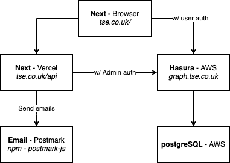

# TheStoryEngine UK

Master branch is live at https://tse.fish through Netlify auto deployment: 

This is a [Next.js](https://nextjs.org/) React application, with a

## Local Development

### Frontend development

After cloning the repository:

- Install NPM dependencies with `npm install`
- Get local instance of backend running with docker:
  - Install docker app https://www.docker.com/products/docker-desktop
    - Navigate to `/infrastructure`
    - Run `docker compose up -d`
    - See [/infrastructure README](infrastructure/README.md) for more details
- Copy `/env.example` to `/.env.local` and enter the keys in `.env.local` for:
  - Stripe
  - Postmark
  - Hasura (see [infrastructure/docker-compose.yaml](infrastructure/docker-compose.yaml) for local defaults)
- Run `npm run dev` in `/`
- Go to http://localhost:3000

### DB changes

- Install Hasura bash app with `curl -L https://github.com/hasura/graphql-engine/raw/stable/cli/get.sh | bash`
  - Navigate to /infrastructure/hasura
  - Run `hasura console`
- Explore the [hasura docs](https://hasura.io/learn/graphql/hasura/data-modelling/1-users-table/) to find out how to add & change database tables in the console.
- As changes are made in the console, hasura will automatically make file changes in `infrastructure/hasura/metadata` & in `infrastructure/hasura/migrations`.
- `migrations` holds SQL migrations run on the underlying PostgreSQL database
- `metadata` holds hasura layer config:
  - Which tables in PostgreSQL to track (`tables.yaml`)
  - User permissions for each table (`tables.yaml`)

## Pages

- `/` - writers can write a story here, if it's the first time they've arrived, a blank story is automatically created and it's ID saved in browser sessionStorage. If an existing story is found in localstorage, the browser connects to that story as the writer.

## API Routes

See the [reqs.http](reqs.http) file for example bodies and responses for each endpoint.
