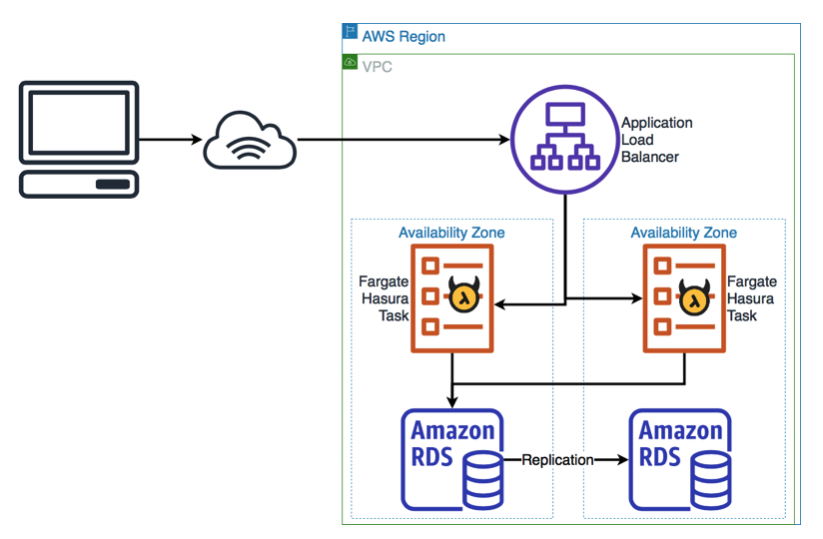

# TSE GraphQL API

A [Hasura](https://hasura.io/) GraphQL API on a [PostgreSQL](https://www.postgresql.org/) database. Deployed to AWS using [AWS CDK](https://aws.amazon.com/cdk/).

This pattern was forked from https://github.com/lineupninja/hasura-cdk

## Infrastructure Layout

The deployed Hasura instance looks like this:



Which is to say a multi-az deployment of both Hasura and Postgres. It can be deployed either multi or single AZ with an environment flag.

In addition to the Hasura deployment a simple API gateway with a single function is deployed, this is use to demonstrate the 'actions' feature in Hasura.

## Project Layout

- `cdk` Contains the main CDK stack
- `actions` Contains a simple lambda handler that returns a 'fortune'
- `hasura` Contains a simple schema that connects the deployed 'action'

## CDK Layout

CDK has been configured into 4 stacks

- `vpc-stack` contains the main VPC component to deploy Hasura into
- `certificates-stack` the ACM certificates for the Hasura and actions endpoints
- `hasura-stack` the main Hasura Fargate and RDS components
- `actions-stack` the API Gateway / Lambda stack for the actions endpoint.

The stack has been split into multiple components to make deployment and rollback easier. Note that new AWS accounts have an ACM limit of 20 certificates, so it's easy to run out of certificates if you regularly build up and tear down the environments.

## How to deploy

We have 2 environments, staging and production. Production is automatically deployed using github actions, from all commits to master. Staging is deployed to manually:

- Sign your local AWS cli in to the TSE AWS account as your IAM user.
- Copy `.env.example` to `.env` and fill out the properties:

```
APP_NAME=Whatever you want to call the app, this is used to name the created objects
AWS_REGION=The region to deploy into
AWS_PROFILE=The profile in ~/.aws/credentials to use
AWS_ACCOUNT_ID=The ID of your AWS account
MULTI_AZ=false or true (false for staging, true for production)
HOSTED_ZONE_ID=The ID of the zone in which to create the DNS records
HOSTED_ZONE_NAME=The name of the same zone
HASURA_ADMIN_SECRET=A secret to use to access the hasura admin interface
HASURA_JWT_SECRET='{"type":"HS256", "key": ""}' - Fill out the 'key' with something with at least 256bit.
HASURA_HOSTNAME=The hostname to use for Hasura, must exist in the hosted zone given above.
ACTIONS_HOSTNAME=The hostname to use for the Actions endpoint, must exist in the hosted zone given above.
```

- To see a preview of the changes do

  - `make diff`

- To deploy:
  - `make deploy`

This has been tested on macOS Catalina only but should work on Linux.

## Learning More

If you need help with your Hasura deployment check out

- The [hasura docs](https://hasura.io/learn/graphql/hasura)
- The `#deployment-help` channel in the [Hasura Discord](https://hasura.io/community/#discord) community.
